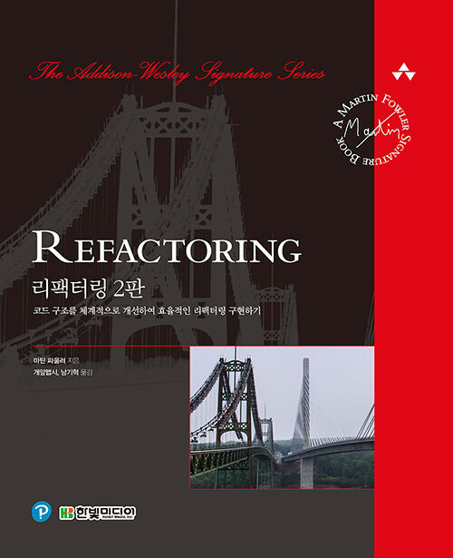

 

  
  

  <h3 align="center">리팩터링 2판 북스터디</h3>
  
  

    리팩터링 2판 완독을 목표로 모여서 함께 읽는 북스터디
     
     
    <a href="https://yisu-kim.notion.site/Refactoring-2-E-e75c3057d83b40098436abc2f1babb91">View Notion</a>
     
     
  

> **Note**
>
> 스터디 시간에 주차별로 정해진 분량을 같이 읽고 밑줄 친 부분에 대해 서로 토의하는 방식으로 진행되므로 사전에 준비할 필요가 없어 부담없이 참여할 수 있습니다.
>
> 책을 읽는 것에 그치지 않고 한 번이라도 본인이 작성하는 코드에서 악취가 나는 부분을 찾아 리팩터링해보고 경험을 공유하는 기회가 되었으면 합니다.

## 진행 상황

- 기간: 10/29(토) ~ 12/18(일)
- 스터디 멤버: [@yisu-kim](https://github.com/yisu-kim), [@sukyoungshin](https://github.com/sukyoungshin), [@wonjin-dev](https://github.com/wonjin-dev),
  [@okyungjin](https://github.com/okyungjin), [@startdata](https://github.com/startdata), [@Yummy-sk](https://github.com/Yummy-sk), [@Hyesooo](https://github.com/Hyesooo)

| 회차 | 목차                                                                  | 날짜            | ✅  |
| ---- | --------------------------------------------------------------------- | --------------- | --- |
| 1    | [2장 리팩터링 원칙](ch02/리팩터링_원칙.md)                            | 2022/10/29 (토) | ✅  |
| 2    | [3장 코드에서 나는 악취](ch03/코드에서_나는_악취.md)                  | 2022/11/05 (토) | ✅  |
| 3    | [4장 테스트 구축](ch04/테스트_구축.md)                                | 2022/11/06 (일) | ✅  |
| 4    | [6장 기본적인 리팩터링 (1)](<ch06/기본적인_리팩터링_(1).md>)          | 2022/11/12 (토) |     |
| 5    | [6장 기본적인 리팩터링 (2)](<ch06/기본적인_리팩터링_(2).md>)          | 2022/11/13 (일) |     |
| 6    | [7장 캡슐화](ch07/캡슐화.md)                                          | 2022/11/19 (토) |     |
| 7    | [8장 기능 이동](ch08/기능_이동.md)                                    | 2022/11/20 (일) |     |
| 8    | [9장 데이터 조직화](ch09/데이터_조직화.md)                            | 2022/11/26 (토) |     |
| 9    | [10장 조건부 로직 간소화](ch10/조건부_로직_간소화.md)                 | 2022/11/27 (일) |     |
| 10   | [11장 API 리팩터링 (1)](<ch11/API_리팩터링_(1).md>)                   | 2022/12/03 (토) |     |
| 11   | [11장 API 리팩터링 (2)](<ch11/API_리팩터링_(2).md>)                   | 2022/12/04 (일) |     |
| 12   | [12장 상속 다루기 (1)](<ch12/상속_다루기_(1).md>)                     | 2022/12/10 (토) |     |
| 13   | [12장 상속 다루기 (2)](<ch12/상속_다루기_(2).md>)                     | 2022/12/11 (일) |     |
| 14   | [1장 리팩터링: 첫 번째 예시 (1)](<ch01/리팩터링_첫_번째_예시_(1).md>) | 2022/12/17 (토) |     |
| 15   | [1장 리팩터링: 첫 번째 예시 (2)](<ch01/리팩터링_첫_번째_예시_(2).md>) | 2022/12/18 (일) |     |

## 진행 방법

### 파트 0. 경험 공유(선택)

- 지난 주 학습한 내용을 바탕으로 다음 경우에 대해 적용하려는/적용한 리팩터링 기법과 이유에 대해 설명합니다.

  - 코드에서 악취나는 부분을 찾은 경우
  - 테스트 코드가 존재하거나 테스크 코드 작성 후 리팩터링한 경우
  - 테스트 코드 없이 안전한 리팩터링 기법을 사용한 경우
  - 새로운 코드를 작성할 때 리팩터링한 경우

- 그 외에 새롭게 알게 된 유용한 정보가 있으면 링크 등을 자유롭게 공유합니다.

### 파트 1. 독서

- 스터디 리더는 스터디 시작 전 책을 읽고 해당 챕터의 예상 시간을 측정합니다.
- 스터디 시간에는 다함께 책을 읽으며 각자 중요하다고 생각하는 부분이나 인상깊은 내용에 밑줄을 긋습니다.
- 예상 시간 내에 못다 읽은 인원이 있으면 5~10분 단위로 시간을 연장합니다.
- 독서 시간이 종료되면 10분간 휴식합니다.

### 파트 2. 토의

- 오늘의 발표자를 뽑고 발표자는 소챕터 단위로 끊어서 본인이 밑줄 친 부분을 읽습니다.
- 오늘의 작성자를 뽑고 작성자는 발표자가 밑줄 친 부분을 기록합니다.
- 발표가 끝나면 나머지 팀원들은 본인이 밑줄 친 부분 또는 발표자가 밑줄 친 부분에 대해 생각을 공유하고 질문합니다.
- 작성자는 나머지 팀원들이 밑줄 친 부분과 토의 내용에 대해 기록합니다.

### 파트 3. 기록

- 작성자는 스터디 종료 후 해당 챕터 파일에 내용을 정리합니다.
- 추가적인 기록을 남기고 싶은 스터디 멤버 누구나 파일에 내용을 추가할 수 있습니다.
- 기본 파일 외에 개인 기록 파일을 생성하거나 본인의 블로그, 노션 링크를 남길 수도 있습니다.

## 유용한 리소스

- [GitHub - WegraLee/Refactoring: 『리팩터링, 2판』(한빛미디어, 2020)](https://github.com/WegraLee/Refactoring)
- [『리팩터링 2판』 정오표 - Google Docs](https://docs.google.com/document/d/1IP04YcBgwOfBexV1CPK3gLCr2gmQdPTas2pHcqPuCz4/edit)
- [리팩터링 이름 비교 & IDE들이 제공하는 리팩터링 목록\_『리팩터링, 2판』(개앞맵시/남기혁 옮김, 한빛미디어, 2020) - Google Sheets](https://docs.google.com/spreadsheets/d/1nFx-PjZ9Qs3QBZFzaMo6MSUSrWjSsO-iz5kpBtlVRPQ/edit#gid=866204681)
- [Refactoring source code in Visual Studio Code](https://code.visualstudio.com/docs/editor/refactoring)
